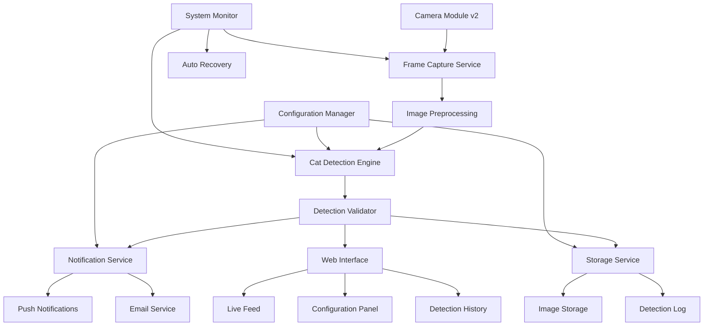

# Design Document

## Overview

The Cat Counter Detection system is a computer vision application designed to run on a Raspberry Pi Zero W with Camera Module v2. The system uses lightweight machine learning models optimized for ARM processors to detect cats on a kitchen counter in real-time, providing immediate notifications and maintaining a detection history.

The architecture prioritizes resource efficiency while maintaining reliable detection accuracy, leveraging edge computing principles to perform all processing locally without external dependencies.

## Architecture



### Core Components

1. **Frame Capture Service**: Manages camera interface and frame acquisition
2. **Cat Detection Engine**: Performs computer vision inference using optimized models
3. **Detection Validator**: Applies confidence thresholds and filtering logic
4. **Notification Service**: Handles multi-channel alert delivery
5. **Storage Service**: Manages image storage and detection logging
6. **Web Interface**: Provides user interface for monitoring and configuration
7. **Configuration Manager**: Handles system settings and preferences
8. **System Monitor**: Ensures system health and automatic recovery

## Components and Interfaces

### Frame Capture Service

**Purpose**: Interface with Camera Module v2 and provide optimized frame delivery

**Key Features**:
- Configurable resolution (default: 640x480 for performance)
- Frame rate optimization (target: 1-2 FPS)
- Automatic exposure and white balance
- Error handling for camera disconnection

**Interface**:
```python
class FrameCaptureService:
    def start_capture(self) -> None
    def get_frame(self) -> np.ndarray
    def stop_capture(self) -> None
    def is_camera_available(self) -> bool
```

### Cat Detection Engine

**Purpose**: Perform efficient cat detection using lightweight ML models

**Model Selection**: 
- Primary: MobileNetV2-based object detection model
- Fallback: OpenCV Haar Cascades for cat detection
- Model size: <50MB to fit in Pi Zero W memory constraints

**Optimization Strategies**:
- Model quantization (INT8) for ARM processors
- Frame downsampling for inference
- Region of Interest (ROI) focusing on counter area
- Temporal smoothing to reduce false positives

**Interface**:
```python
class CatDetectionEngine:
    def load_model(self, model_path: str) -> None
    def detect_cats(self, frame: np.ndarray) -> List[Detection]
    def set_confidence_threshold(self, threshold: float) -> None
    def set_roi(self, roi: Tuple[int, int, int, int]) -> None
```

### Detection Validator

**Purpose**: Apply business logic and filtering to raw detections

**Validation Rules**:
- Confidence threshold filtering (default: 70%)
- Size filtering (minimum bounding box size)
- Position filtering (counter area only)
- Temporal consistency (detection must persist for 2+ frames)
- Cat counting logic for multiple detections

**Interface**:
```python
class DetectionValidator:
    def validate_detections(self, detections: List[Detection]) -> List[ValidDetection]
    def count_cats(self, detections: List[ValidDetection]) -> int
    def is_on_counter(self, detection: Detection) -> bool
```

### Notification Service

**Purpose**: Deliver alerts through multiple channels with reliability

**Notification Channels**:
- Push notifications via Firebase Cloud Messaging (FCM)
- Email notifications with image attachments
- Local audio alerts (optional)

**Reliability Features**:
- Retry mechanism with exponential backoff
- Queue management for offline scenarios
- Rate limiting to prevent spam
- Notification deduplication

**Interface**:
```python
class NotificationService:
    def send_push_notification(self, message: str, image_path: str) -> bool
    def send_email(self, subject: str, body: str, image_path: str) -> bool
    def queue_notification(self, notification: Notification) -> None
    def process_queue(self) -> None
```

### Storage Service

**Purpose**: Manage detection images and historical data efficiently

**Storage Strategy**:
- Local storage on SD card
- Automatic cleanup after 30 days
- Compressed image storage (JPEG, quality 85%)
- SQLite database for detection metadata
- Circular buffer for system logs

**Data Models**:
```python
@dataclass
class DetectionRecord:
    timestamp: datetime
    cat_count: int
    confidence_score: float
    image_path: str
    bounding_boxes: List[BoundingBox]
```

**Interface**:
```python
class StorageService:
    def save_detection(self, detection: ValidDetection, image: np.ndarray) -> str
    def get_detection_history(self, start_date: datetime, end_date: datetime) -> List[DetectionRecord]
    def cleanup_old_data(self) -> None
    def get_storage_usage(self) -> StorageStats
```

### Web Interface

**Purpose**: Provide user-friendly monitoring and configuration interface

**Features**:
- Live camera feed (MJPEG stream)
- Real-time detection overlay
- Detection history with image gallery
- Configuration panel for all settings
- System status and health monitoring
- Mobile-responsive design

**Technology Stack**:
- Backend: Flask (lightweight Python web framework)
- Frontend: HTML5, CSS3, JavaScript
- Real-time updates: Server-Sent Events (SSE)
- Image streaming: MJPEG over HTTP

## Data Models

### Detection Data Model

```python
@dataclass
class BoundingBox:
    x: int
    y: int
    width: int
    height: int
    confidence: float

@dataclass
class Detection:
    timestamp: datetime
    bounding_boxes: List[BoundingBox]
    frame_width: int
    frame_height: int
    raw_confidence: float

@dataclass
class ValidDetection(Detection):
    cat_count: int
    is_on_counter: bool
    validated_confidence: float
```

### Configuration Data Model

```python
@dataclass
class SystemConfig:
    # Detection settings
    confidence_threshold: float = 0.7
    detection_roi: Tuple[int, int, int, int] = (0, 0, 640, 480)
    
    # Monitoring schedule
    monitoring_enabled: bool = True
    monitoring_start_hour: int = 0
    monitoring_end_hour: int = 23
    
    # Notification settings
    push_notifications_enabled: bool = True
    email_notifications_enabled: bool = False
    notification_cooldown_minutes: int = 5
    
    # Storage settings
    max_storage_days: int = 30
    image_quality: int = 85
    
    # Performance settings
    target_fps: float = 1.0
    max_cpu_usage: float = 50.0
```

## Error Handling

### Camera Errors
- **Camera disconnection**: Automatic retry with exponential backoff
- **Frame capture failure**: Skip frame and continue processing
- **Camera initialization failure**: System alert and graceful degradation

### Detection Errors
- **Model loading failure**: Fallback to alternative detection method
- **Inference timeout**: Skip frame and log warning
- **Memory exhaustion**: Trigger garbage collection and reduce frame rate

### Notification Errors
- **Network connectivity issues**: Queue notifications for later delivery
- **Service authentication failure**: Log error and retry with fresh credentials
- **Rate limiting**: Implement backoff and respect service limits

### Storage Errors
- **Disk space exhaustion**: Trigger emergency cleanup of old data
- **Database corruption**: Rebuild database from available data
- **File system errors**: Log errors and attempt recovery

### Recovery Strategies
- **Automatic service restart**: Monitor service health and restart failed components
- **System resource monitoring**: Implement watchdog for memory and CPU usage
- **Configuration validation**: Validate settings on startup and reject invalid values
- **Graceful degradation**: Continue core functionality even when non-critical components fail

## Testing Strategy

### Unit Testing
- **Component isolation**: Test each service independently with mocks
- **Edge case coverage**: Test boundary conditions and error scenarios
- **Performance testing**: Validate resource usage under various loads
- **Configuration testing**: Verify all configuration combinations work correctly

### Integration Testing
- **End-to-end detection flow**: Test complete pipeline from camera to notification
- **Hardware integration**: Test with actual Pi Zero W and camera module
- **Network integration**: Test notification delivery under various network conditions
- **Storage integration**: Test data persistence and retrieval operations

### Performance Testing
- **Resource utilization**: Monitor CPU, memory, and storage usage
- **Detection latency**: Measure time from cat appearance to notification
- **System stability**: Long-running tests (24+ hours) to verify stability
- **Thermal testing**: Ensure system operates within temperature limits

### User Acceptance Testing
- **Detection accuracy**: Test with both lynx point and tabby cats
- **False positive rate**: Verify system doesn't trigger on non-cat objects
- **Notification reliability**: Confirm notifications arrive consistently
- **Web interface usability**: Test all user interface functions

### Automated Testing Framework
- **Continuous integration**: Automated testing on code changes
- **Mock hardware**: Simulate camera input for development testing
- **Test data sets**: Curated images for consistent detection testing
- **Performance benchmarks**: Automated performance regression testing

## Deployment Considerations

### Hardware Setup
- Raspberry Pi Zero W with 512MB RAM
- Camera Module v2 (8MP, 1080p)
- High-speed SD card (Class 10, 32GB minimum)
- Adequate power supply (2.5A recommended)
- Heat dissipation (passive cooling recommended)

### Software Dependencies
- Raspberry Pi OS Lite (minimal installation)
- Python 3.9+ with optimized libraries
- OpenCV compiled with ARM optimizations
- TensorFlow Lite for ARM
- SQLite for data storage

### Network Configuration
- WiFi connectivity for notifications
- Static IP assignment (optional)
- Port forwarding for remote web access (optional)
- Firewall configuration for security

### Security Considerations
- Web interface authentication
- HTTPS for remote access
- Regular security updates
- Network isolation options
- Data encryption for sensitive information